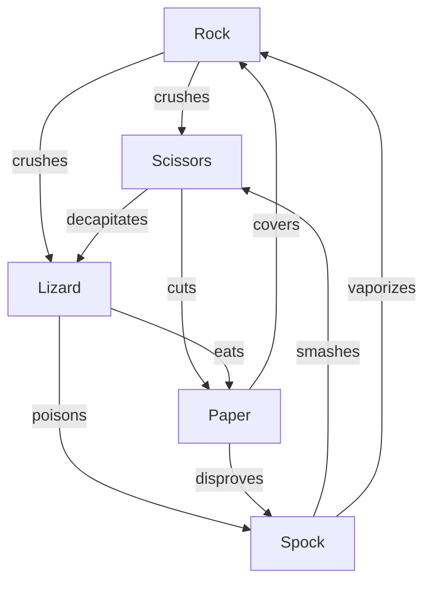

# ✊✋✌️ Rock-Paper-Scissors: Tournament & AI Arena (C++17)

[](https://en.cppreference.com/w/cpp/17)
[](#-compilation--building)
[](LICENSE)
[](#-compilation--building)

```
  ╔═════════════════════════════════════════════════════════════════════════╗
  ║   ____   ___   ____ _  __   ____   _    ____  _____ ____    ____  ____  ║
  ║  |  _ \ / _ \ / ___| |/ /  |  _ \ / \  |  _ \| ____|  _ \  / ___||  _ \ ║
  ║  | |_) | | | | |   | ' /   | |_) / _ \ | |_) |  _| | |_) | \___ \| |_) |║
  ║  |  _ <| |_| | |___| . \   |  __/ ___ \|  __/| |___|  _ <   ___) |  __/ ║
  ║  |_| \_\\___/ \____|_|\_\  |_| /_/   \_\_|   |_____|_| \_\ |____/|_|    ║
  ╚═════════════════════════════════════════════════════════════════════════╝
               ★  TOURNAMENT & GAME THEORY ARENA (C++17)  ★
```

**Rock-Paper-Scissors: Tournament & AI Arena** is a feature-packed terminal application built in **Modern C++17**. Designed with clean object-oriented architecture, advanced **Game Theory analytics (Shannon Entropy, Nash Equilibrium TVD)**, an **Adaptive 2nd-Order Markov Chain AI Predictor**, psychological **Win-Stay Lose-Shift (WSLS)** modeling, 6 rich game modes, local secret 2-player multiplayer, 256-color ANSI themes, persistent progression profiles, and 12 automated unit test suites.

---

## 🌟 Key Features

### 🕹️ 2 Rulesets & Directed Payoff Graphs
1. **Classic 3-Way**: Rock, Paper, Scissors ($3$-cycle directed tournament graph).
2. **Extended 5-Way RPSLS**: Rock, Paper, Scissors, Lizard, Spock ($5$-cycle balanced graph).



---

### 🎮 6 Distinct Game Modes
1. **Quick Match Duel**: Single high-stakes round against a selected AI personality.
2. **Best of N Tournament**: Best-of 3, 5, 7, or 11 rounds featuring real-time series momentum meters, round history logs, and sudden death tension.
3. **Gauntlet Boss Rush**: Fight a 5-tier ladder of increasingly intelligent AI personalities (Randomizer $\to$ Brute $\to$ Mimic $\to$ Tactician $\to$ Markov Oracle).
4. **Endless Survival**: Start with 3 lives. Defeat endless waves of AI opponents. Streak multipliers amplify score, and bonus lives are awarded every 5 consecutive wins.
5. **Pass & Play (Local 2-Player)**: Secret masked keyboard input (`*`) for fair head-to-head local showdowns with dramatic simultaneous reveals and battle clash art.
6. **AI vs AI Simulation Arena**: Run automated battles between any two AI algorithms (up to 5,000 rounds) to inspect strategy convergence, win rate shifts, and Nash equilibrium adherence.

---

### 🧠 5 AI Cognitive Personalities

| Level | Personality | Strategy & Algorithm |
| :---: | :--- | :--- |
| **1** | **Chaos Randomizer** | Pure uniform stochastic sampling via `<random>` `std::mt19937_64`. |
| **2** | **Rocky Brute** | High kinetic inertia with heavy bias towards power moves (Rock/Spock). |
| **3** | **Mirror Mimic** | Recycles past player moves or plays immediate anticipatory counters. |
| **4** | **WSLS Tactician** | Exploits human cognitive biases: Win-Stay (repeating winning moves) and Lose-Shift (switching moves on defeat). |
| **5** | **Markov Oracle** | Adaptive 1st & 2nd-order Markov transition matrices with exponential recency decay ($\gamma = 0.96$) and $\epsilon$-greedy exploration. |

---

### 📊 Game Theory & Information Theory Profiler
- **Shannon Entropy $H(X)$**: Quantifies the information entropy and randomness of player throws:
  $$H(X) = - \sum_{i=1}^k p_i \log_2(p_i)$$
  - Classic $H_{\max} = \log_2(3) \approx 1.585\text{ bits}$
  - RPSLS $H_{\max} = \log_2(5) \approx 2.322\text{ bits}$
- **Predictability Index**: Normalized metric ($0\%$ = pure stochastic chaos, $100\%$ = deterministic loop):
  $$\text{Predictability} = 1.0 - \frac{H(X)}{H_{\max}}$$
- **Nash Equilibrium Distance**: Total Variation Distance (TVD) measuring deviation from the uniform mixed strategy Nash equilibrium ($1/k$):
  $$\text{TVD} = \frac{1}{2} \sum_{i=1}^k \left| p_i - \frac{1}{k} \right|$$
- **Win-Stay / Lose-Shift Tendency Meters**: Real-time evaluation of psychological habits after wins and losses.

---

### 🏆 Mastery Ranks & Achievement Vault

#### Career Mastery Ladder
- **Novice Brawler** ($0$ pts)
- **Tactical Duelist** ($500$ pts)
- **Hand Master** ($2,000$ pts)
- **Psychology Reader (★)** ($5,000$ pts)
- **Markov Dominator (★★)** ($10,000$ pts)
- **Grandmaster of Hands (★★★)** ($15,000+$ pts)

#### 12 Unlockable Achievement Badges

| Badge | Title | Condition |
| :---: | :--- | :--- |
| `[1B]` | **First Blood** | Win your very first round in the arena |
| `[CM]` | **Classic Master** | Win 10 matches in Classic 3-Way mode |
| `[SP]` | **Spock's Logic** | Win 5 rounds using the Spock gesture |
| `[LK]` | **Lizard King** | Win 5 rounds using the Lizard gesture |
| `[FS]` | **Flawless Sweep** | Win a Best-of-5 tournament without dropping a single round |
| `[GC]` | **Gauntlet Conqueror** | Defeat all 5 AI personalities in Gauntlet Boss Rush |
| `[SW]` | **Survival Warrior** | Achieve a 10-win streak in Endless Survival mode |
| `[EM]` | **Entropy Master** | Maintain high unpredictable entropy ($> 90\%$) over 20+ rounds |
| `[MR]` | **Mind Reader** | Defeat the Markov Oracle AI in a Best-of-7 series |
| `[1C]` | **Century Brawler** | Play 100 total career rounds across all game modes |
| `[TT]` | **Master Tactician** | Defeat the WSLS Tactician with zero losses in a series |
| `[GM]` | **Grandmaster** | Accumulate over 10,000 career Mastery Score points |

---

### 🎨 Visual Themes & UI Polish
Customizable 256-color ANSI themes with retro box-drawing aesthetics and toggleable audio/visual feedback:
- **Neon Cyberpunk** (Bright Cyan & Neon Magenta)
- **Matrix Emerald** (Vivid Green & Lime Gold)
- **Sunset Crimson** (Vivid Amber, Orange & Rose)
- **Deep Ocean** (Deep Sky Blue & Turquoise)
- **Royal Amethyst** (Purple, Violet & Soft Rose)
- **Monochrome Clean** (Minimalist Pure Slate & Silver)

---

## 📁 Project Architecture

```
Rock-Paper-Scissors/
├── .github/
│   └── workflows/
│       └── ci.yml               # Multi-OS GitHub Actions CI matrix
├── src/
│   ├── Types.hpp                # Enums, structs, achievements, profiles, results
│   ├── Terminal.hpp             # ANSI escape codes, box drawing, 256-color themes, masked inputs
│   ├── Terminal.cpp
│   ├── InputValidator.hpp       # Stream sanitization, range checks, letter/number parsing
│   ├── InputValidator.cpp
│   ├── RandomGenerator.hpp      # Modern C++ <random> std::mt19937_64 engine & weighted sampling
│   ├── RandomGenerator.cpp
│   ├── RulesEngine.hpp          # Resolves matchups for Classic (3-way) & RPSLS (5-way), action verbs
│   ├── RulesEngine.cpp
│   ├── AiPredictor.hpp          # AI models: Random, Brute, Mimic, WSLS, Adaptive Markov Chain
│   ├── AiPredictor.cpp
│   ├── GameTheoryAnalyzer.hpp   # Shannon Entropy, Nash TVD, Win-Stay / Lose-Shift profiler
│   ├── GameTheoryAnalyzer.cpp
│   ├── StatsManager.hpp         # File persistence (rps_stats.dat), scoring, ranks, achievements
│   ├── StatsManager.cpp
│   ├── AsciiArt.hpp             # Hand gestures ASCII art, countdowns, clash animation renderer
│   ├── AsciiArt.cpp
│   ├── GameEngine.hpp           # Coordinates game modes, lifecycles, series, survival
│   ├── GameEngine.cpp
│   └── main.cpp                 # Interactive CLI menu, theme selector, settings dispatcher
├── tests/
│   └── test_runner.cpp          # Automated unit test suite (12 test suites, 57 unit tests)
├── CMakeLists.txt               # Cross-platform CMake configuration
├── build.bat                    # Windows MSVC 1-click build script
├── build.sh                     # Unix GCC/Clang build script
├── .gitignore
├── LICENSE                      # MIT License
└── README.md                    # Comprehensive documentation
```

---

## 🛠️ Compilation & Building

### Windows (MSVC)
Run the automated build script:
```cmd
build.bat
```
Run the game:
```cmd
bin\rps_game.exe
```

### Linux / macOS (GCC / Clang)
```bash
chmod +x build.sh
./build.sh
./bin/rps_game
```

### CMake (Cross-Platform)
```bash
cmake -B build -DCMAKE_BUILD_TYPE=Release
cmake --build build --config Release
ctest --test-dir build --output-on-failure
```

---

## 🧪 Running Unit Tests

To run the full suite of 57 automated unit tests:

```cmd
bin\rps_tests.exe
```

### Test Coverage Highlights:
- ✅ Classic 3-way cyclic resolution and payoff symmetry
- ✅ Extended 5-way RPSLS resolution for all 10 outcome pairs
- ✅ Dynamic action verbs (`crushes`, `cuts`, `covers`, `poisons`, `decapitates`, `eats`, `disproves`, `vaporizes`, `smashes`)
- ✅ Winning counter-moves and losing victim queries
- ✅ Uniform RNG bounds and seed reproducibility
- ✅ Information-theoretic **Shannon Entropy** calculation ($0 \le H \le H_{\max}$)
- ✅ **Nash Equilibrium** Total Variation Distance (TVD) evaluations
- ✅ **Markov Chain** transition matrix updates and sequence prediction
- ✅ **Win-Stay Lose-Shift (WSLS)** psychology heuristic state machine
- ✅ Profile serialization and deserialization data integrity
- ✅ Career mastery rank calculations and achievement unlock triggers
- ✅ ASCII art dimensional constraints and layout invariants

---

## 📜 License

This project is licensed under the **MIT License**. See [LICENSE](LICENSE) for details.
